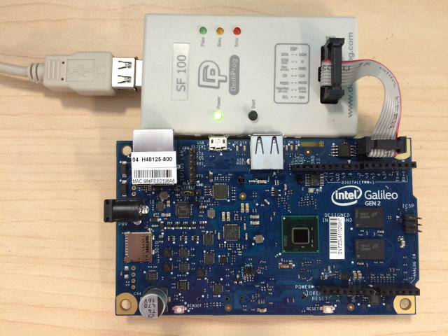
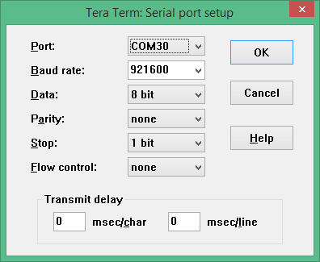
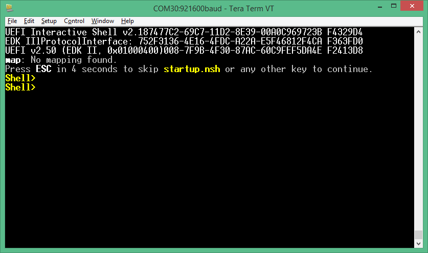

**QuarkPlatformPkg - EDK II firmware for Intel(R) Quark SoC X1000 based platforms**

# 

**Features**
* UEFI firmware image with ability to enable/disable major features such as
    - Logging
    - Source level debug using Intel(R) UDK Debugger Tool
    - Boot Performance Measurements
    - UEFI Secure Boot with Physical Presence
    - TCG Measured Boot using TPM 1.2 hardware devices on I2C bus
* Minimal firmware image for initial power-on and debug
* UEFI Shell built into FLASH image
* UEFI Yocto Linux operating system boot support from Micro SD FLASH
* Hardware Support
    -  [Intel(R) Quark SoC X1000 CPU](http://www.intel.com/content/www/us/en/embedded/products/quark/quark-x1000-datasheet.html)
    -  [Intel(R) Gaileo Development Board](http://www.intel.com/content/www/us/en/embedded/products/galileo/galileo-g1-datasheet.html)
    -  [Intel(R) Galileo Gen 2 Development Board](http://www.intel.com/content/www/us/en/embedded/products/galileo/galileo-overview.html)
    -  HPET Timer
    -  Real Time Clock
* Major I/O Subsystems
    - PCI including support for Mini PCI Express Cards
    - USB using EHCI and OHCI host controllers
    - Micro SD FLASH with FAT file system support
    - Serial UART up to 921600 baud for console, logging, and debug
* ACPI Tables with ACPI S3 sleep state support
* SMBIOS Tables

# 

**Windows Build Instructions**

## 

Pre-requisites:
* GIT client: Available from https://git-scm.com/downloads
* Microsoft Visual Studio
* ASL compiler: Available from http://www.acpica.org

Create a new directory for an EDK II WORKSPACE. 

The code block below shows the GIT clone operations required to pull the EDK II source tree, the FatPkg sources, the pre-built versions of BaseTools as WIN32 binaries, the edk2-non-osi repository that provides a binary file for the Quark Remote Management Unit (RMU).

Next it sets environment variables that must be set before running edkSetup.bat. Since content is being pulled from multiple repositories, the EDK II [Multiple Workspace](https://github.com/tianocore/tianocore.github.io/wiki/Multiple_Workspace)
feature is used.

Next, the edkSetup.bat file is run to complete the initialization of an EDK II build environment.  Two example build commands are shown.  The first one in QuarkPlatformPlg/Quark.dsc builds a full UEFI firmware image that is able to boot the built-in UEFI Shell and Yocto Linux from a micro SD FLASH card.  The second one in QuarkPlatformPkg/QuarkMin.dsc builds a minimal firmware image that is useful for initial power-on and debug of new features.

``````
git clone https://github.com/tianocore/edk2.git
git clone https://github.com/tianocore/edk2-FatPkg.git FatPkg
git clone https://github.com/tianocore/edk2-BaseTools-win32.git
git clone https://github.com/tianocore/edk2-non-osi.git

set WORKSPACE=%CD%
set PACKAGES_PATH=%WORKSPACE%\edk2;%WORKSPACE%\edk2-non-osi
set EDK_TOOLS_BIN=%WORKSPACE%\edk2-BaseTools-win32

cd edk2
edkSetup.bat

build -a IA32 -t VS2015x86 -p QuarkPlatformPkg/Quark.dsc
build -a IA32 -t VS2015x86 -p QuarkPlatformPkg/QuarkMin.dsc
``````
# 

**Linux Build Instructions**

Pre-requisites:
* GIT client
* GCC 4.9 compiler
* ASL compiler: Available from http://www.acpica.org

Create a new directory for an EDK II WORKSPACE.

The code block below shows the GIT clone operations required to pull the EDK II source tree, the FatPkg sources, and the edk2-non-osi repository that provides a binary file for the Quark Remote Management Unit (RMU).

Next it sets environment variables that must be set before running edkSetup.bat. Since content is being pulled from multiple repositories, the EDK II [Multiple Workspace](https://github.com/tianocore/tianocore.github.io/wiki/Multiple_Workspace)
feature is used.

Next, the EDK II BaseTools required to build firmware images are built.

Next, the edkSetup.bat file is run to complete the initialization of an EDK II build environment.  Two example build commands are shown.  The first one in QuarkPlatformPlg/Quark.dsc builds a full UEFI firmware image that is able to boot the built-in UEFI Shell and Yocto Linux from a micro SD FLASH card.  The second one in QuarkPlatformPkg/QuarkMin.dsc builds a minimal firmware image that is useful for initial power-on and debug of new features.

``````
git clone https://github.com/tianocore/edk2.git
git clone https://github.com/tianocore/edk2-FatPkg.git FatPkg
git clone https://github.com/tianocore/edk2-non-osi.git

export WORKSPACE=$PWD
export PACKAGES_PATH=$WORKSPACE/edk2:$WORKSPACE/edk2-non-osi
export EDK_TOOLS_PATH=$WORKSPACE/edk2/BaseTools

make –C edk2/BaseTools

cd $WORKSPACE/edk2

. edksetup.sh BaseTools

build –a IA32 –t GCC49 –p QuarkPlatformPkg/Quark.dsc
build –a IA32 –t GCC49 –p QuarkPlatformPkg/QuarkMin.dsc
``````

# 

**Build Features**

The table below contains a summary of the build flags to enable or disable features on the build command line using ```-D``` flags.

| **Define Name**          | **Default Value**   | **Supported Values** |
| ------------------------ | ------------------- | -------------------- |
| ```GALILEO```              |                GEN2 | GEN1, GEN2           |
| ```LOGGING```              |                TRUE | TRUE, FALSE          |
| ```SOURCE_DEBUG_ENABLE```  |               FALSE | TRUE, FALSE          |
| ```PERFORMANCE_ENABLE```   |               FALSE | TRUE, FALSE          |
| ```SECURE_BOOT_ENABLE```   |               FALSE | TRUE, FALSE          |
| ```MEASURED_BOOT_ENABLE``` |               FALSE | TRUE, FALSE          |
| ```TPM_12_HARDWARE```      |                NONE | NONE, LPC, ATMEL_I2C, INFINEON_I2C |

* ```GALILEO``` - Used to specify the type of Intel(R) Gaileo board type.  The default is ```GEN2``` for the [Intel(R) Galileo Gen 2 Development Board](http://www.intel.com/content/www/us/en/embedded/products/galileo/galileo-overview.html).  The other supported value is ```GEN1``` for the [Intel(R) Galileo Development Board](http://www.intel.com/content/www/us/en/embedded/products/galileo/galileo-g1-datasheet.html).  Add ```-D GALILEO=GEN1``` to the build command for [Intel(R) Gaileo Development Board](http://www.intel.com/content/www/us/en/embedded/products/galileo/galileo-g1-datasheet.html).

* ```LOGGING``` - Used to enable/disable logging messages from DEBUG() macros to a serial UART.  The default is TRUE for enabled when the BUILDTARGET is DEBUG (```-b DEBUG```).  The default is FALSE for disabled when the BUILDTARGET is not DEBUG (e.g. ```-b RELEASE```).  Add ```-D LOGGING``` to the build command to force logging enabled.  Add ```-D LOGGING=FALSE``` to force logging disabled.

* ```SOURCE_DEBUG_ENABLE``` - Used to enable/disable source level debug using the [Intel(R) UDK Debugger Tool](https://firmware.intel.com/develop/intel-uefi-tools-and-utilities/intel-uefi-development-kit-debugger-tool).  The default is FALSE for disabled.  Add ```-D SOURCE_DEBUG_ENABLE``` to the build command line to enable source level debug.

* ```PERFORMANCE_ENABLE``` - Used to enable/disable boot performance measurement.  The default is FALSE for disabled.  Add ```-D PERFORMANCE_ENABLE``` to the build command line to enable boot performance measurement.  When this feature is enabled, both ```LOGGING``` and ```SOURCE_DEBUG_ENABLE``` are automatically disabled so there is not boot time overhead from the serial UART for logging messages or the debug agent.

* ```SECURE_BOOT_ENABLE``` - Used to enable/disable UEFI Secure Boot features.  The default is FALSE for disabled.  Add ```-D SECURE_BOOT_ENABLE``` to the build command line to enable UEFI Secure Boot features.

* ```MEASURED_BOOT_ENABLE``` - Used to enable/disable measurement of firmware code and data into a TPM 1.2 hardware device.  The default is FALSE for disabled.  Add ```-D MEASURED_BOOT_ENABLE``` to the build command line to enable UEFI Secure Boot features.

* ```TPM_12_HARDWARE``` - Used to specify the type of TPM 1.2 hardware device that is connected to the Galileo board.  This define is valid if the measure boot feature is enabled using ```-D MEASURED_BOOT_ENABLE```.  The default is NONE for no TPM 1.2 hardware device connected.  Add ```-D TPM_12_HARDWARE=LPC``` for a TPM hardware device attached to an LPC bus (not supported on on Intel(R) Quark SoC X1000).  Add ```-D TPM_12_HARDWARE=ATMEL_I2C``` for an [Atmel AT97SC3204T](http://www.atmel.com/devices/AT97SC3204T.aspx) or  [Atmel AT97SC3205T](http://www.atmel.com/images/atmel-8883s-tpm-at97sc3205t-datasheet-summary.pdf) attached to the I2C bus of the Galileo Arduino header.  Add ```-D TPM_12_HARDWARE=INFINION_I2C``` for an [Infineon SLB9645](http://www.infineon.com/dgdl/Infineon-TPM+SLB+9645-DS-v01_00-EN.pdf?fileId=5546d4625185e0e201518b83d0c63d7c) attached to the I2C bus of the Galileo Arduino header.  The ATMEL_I2C setting has been tested with the [CryptoShield](https://www.sparkfun.com/products/13183) available from [SparkFun](https://www.sparkfun.com/).
  

## 

**Example Build Commands**

Default build with logging enabled:

```build -a IA32 -t VS2015x86 -p QuarkPlatformPkg/Quark.dsc```

Release build with logging disabled:

```build -a IA32 -t VS2015x86 -p QuarkPlatformPkg/Quark.dsc -b RELEASE```

Enable source level debugging:

```build -a IA32 -t VS2015x86 -p QuarkPlatformPkg/Quark.dsc -D SOURCE_DEBUG_ENABLE```

Enable boot performance metrics:

```build -a IA32 -t VS2015x86 -p QuarkPlatformPkg/Quark.dsc -D PERFORMANCE_ENABLE```

Enable UEFI Secure Boot features:

```build -a IA32 -t VS2015x86 -p QuarkPlatformPkg/Quark.dsc -D UEFI_SECURE_BOOT```

Enable both UEFI Secure Boot features and measure boot using Atmel I2C TPM hardware device:

```build -a IA32 -t VS2015x86 -p QuarkPlatformPkg/Quark.dsc -D UEFI_SECURE_BOOT -D MEASURED_BOOT_ENABLE -D TPM_12_HARDWARE=ATMEL_I2C```


# 

**FLASH Update using DediProg SF100**

Once the sources have been downloaded, an EDK II build environment established, and an EDK II firmware image has been built, the EDK II firmware image needs to installed into the FLASH device on the target Galileo development board.  One way to do this is with the [Dediprog SF100 IC Programmer](http://www.dediprog.com/pd/spi-flash-solution/SF100).  

* Install the DediProg SF100 software.

* Connect the DediProg SF100 to the Galileo development board.

    

* Make sure ```dpcmd.exe``` is in ```PATH```

    ```PATH=%PATH%;"c:\Program Files (x86)\DediProg\SF100"```
    
* **NOTE**: It is recommended that the FLASH image that was shipped with the Galileo development board be read and saved before updating FLASH image.  The command shown below read the FLASH image and saves it to the file called ```GalileoOriginalFirmware.bin```.

    ```dpcmd.exe -r GalileoOriginalFirmware.bin```

* Update FLASH image using either the DediProg SF100 GUI or the ```dpcmd.exe``` utility.
    * Example update of Galileo firmware image when BUILDTARGET is DEBUG (default)
    
        ```dpcmd.exe -u%WORKSPACE%\Build\Quark\DEBUG_VS2015x86\FV\QUARK.fd ```
    
    * Example update of Galileo firmware image when BUILDTARGET is RELEASE (```-b RELEASE```)
    
        ```dpcmd.exe -u%WORKSPACE%\Build\Quark\RELEASE_VS2015x86\FV\QUARK.fd ```

# 

**Setting up a Serial Console and Booting to UEFI Shell**

After the FLASH is updated on Galileo, a serial cable is connected between the host system and the Galileo target.  A serial terminal emulator (such as [Tera Term](https://en.osdn.jp/projects/ttssh2/releases/)) can be used to see the logging messages from DEBUG() macros and the serial console for the UEFI Boot Manager, UEFI Shell, and operating system.

The default serial communication parameters for the Intel(R) Galileo Gen 2 Development Board is 921600,n,8,1 with no hardware flow control.




The default serial communication parameters for the Intel(R) Galileo Development Board is 461800,n,8,1 with no hardware flow control.

Connect power adapter to Galileo development board, and the logging messages should be seen, followed by 5 second countdown, followed by an automatic boot to the built-in UEFI Shell.



The following changes to the Tera Term configuration files are recommended for UEFI cserial console compatiblity.  Some of the later use cases involve using Tera Term in its TCPIP mode, so some of these recommendedation apply to those use cases.

* KEYBOARD.CNF - Disable VT function keys for F5..F10
 

```
[VT function keys]
;F5 key
;F5=63
;F6 key
;F6=64
;F7 key
;F7=65
;F8 key
;F8=66
;F9 key
;F9=67
;F10 key
;F10=68
```

* KEYBOARD.CNF - Disable X function keys for F1..F4

```
[X function keys]
; F1 key
XF1=off
; F2 key
;XF2=60
XF2=off
; F3 key
;XF3=61
XF3=off
; F4 key
;XF4=62
XF4=off
; F5 key
;XF5=63
```

* KEYBOARD.CNF - Add UEFI serial console sequences for F1..F10

```
[User keys]
User1=59,0,$1B[M
User2=60,0,$1B[N
User3=61,0,$1B[O
User4=62,0,$1B[P
User5=63,0,$1B[Q
User6=64,0,$1B[R
User7=65,0,$1B[S
User8=66,0,$1B[T
User9=67,0,$1B[U
User10=68,0,$1B[V
```

* TERATERM.INI - Disable line mode to make TCPIP mode work like COM port mode.

```
; Line at a time mode
EnableLineMode=off
```


# 

**Install, Configure, and Boot Yocto Linux**

# 

**Source Debug Using Intel(R) UDK Debugger Tool**

# 

**JTAG Debug Using Intel(r) System Studio Debugger**

# 

**UEFI Secure Boot Feature and Physical Presence**

# 

**Testing Measured Boot Feature using Atmel I2C TPM on CryptoShield**

# 

**Measuring Boot Performance**
